# Hiking notes app

## Note

This was originally a private group project hosted on GitLab, but I got the permission to clone the repo here. Some of the code might be outdated since I've cloned it before we had our last sprint (currently on the 4th release, 11th sprint).

## The group

- Mateusz Bryl
- Hubert Grzesiak
- Szymon Grzesiak
- Marcin Kleczewski 👑
- Szymon Kolański

## The functionality

- Role based functionality:
  - Guest
    - view and filter mountain routes
    - view static pages like the terms of service, etc.
    - register an account or log onto an existing one
  - Turysta (Tourist, regular user)
    - Guest functinality (ommiting the register and login functionality)
    - tourist book to note mountain trips
    - submit tourist book for GOT PTTK badges
  - Przodownik (Expert tourist)
    - Tourist functionality
    - verify mountain trips based on their permissions - within specific subregions
  - Referat (Field Verification Offices)
    - promote Tourists to the Expert role
    - verify tourists books for badge progress
    - manage user badges
  - Administrator (Admin)
    - user and user role management
    - region, subregion, place, route (mountain trail made from two points - places) management
- NextAuth.js user authentication via credentials or providers (Google & GitHub)
- Resend API mail for password reset, email verification and 2FA.
- PostgreSQL database in the cloud via Supabase
- responsive ui with the shadcn library

## My input

- leading the team through most sprints
  - allocating tasks to specific team members
  - arranging coprogramming sessions
  - making and presenting documentation (reports, diagrams, models, etc.)
  - explaining business processes to teammates
  - making critical decisions in regards to the technology stack
  - code review
- role functionality
  - Admin
    - CRUD for regions, subregions, places and routes
  - Field Verification Offices
    - designing, mocking and implementing the Expert promotion view
  - Expert
    - designing the book verification view
  - Tourist
    - designing the book view
  - Guest
    - creating the routes listing and adding filtering options
- creating some of the static pages
  - about page
  - ToS page
- adjusting the middleware for various role access

## Gallery

Since the project isn't currently deployed, I added some screenshots to showcase the functionality. I still have the project setup locally so I could always showcase it myself if there'd be a need for that.

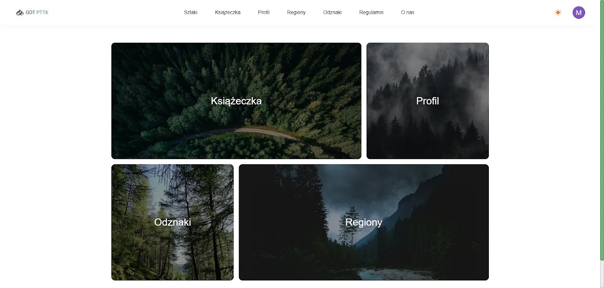
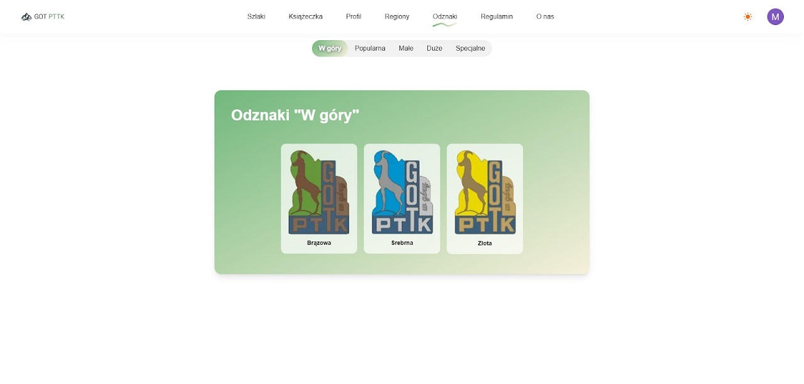
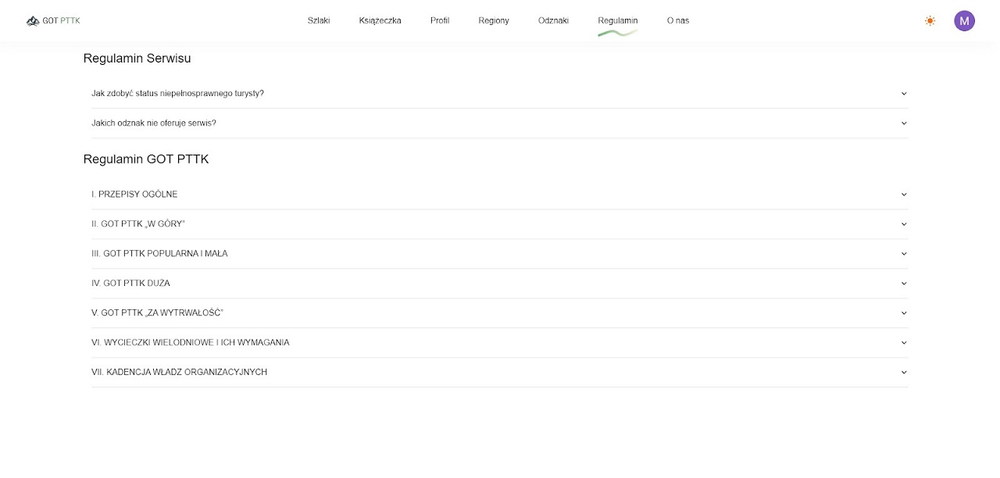
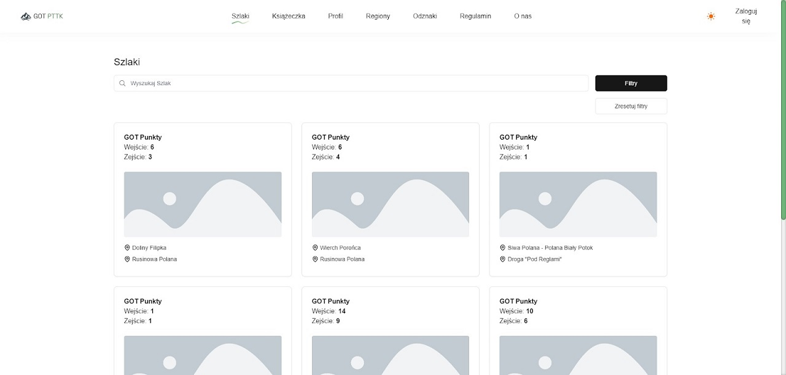
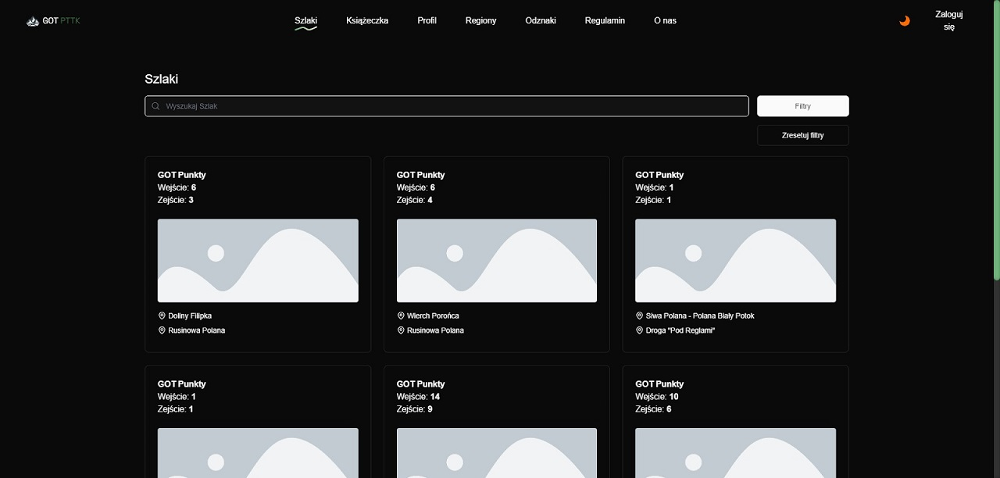
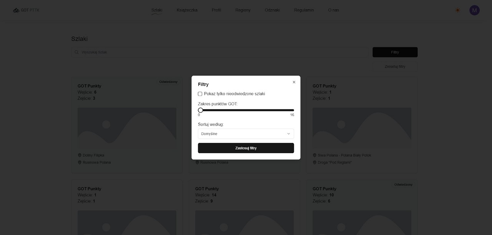
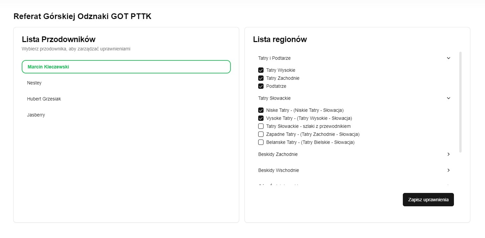
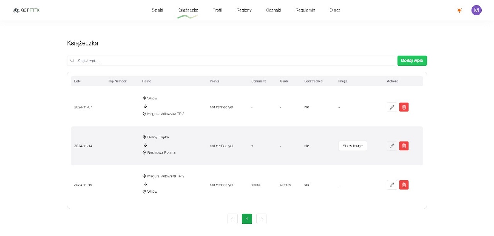
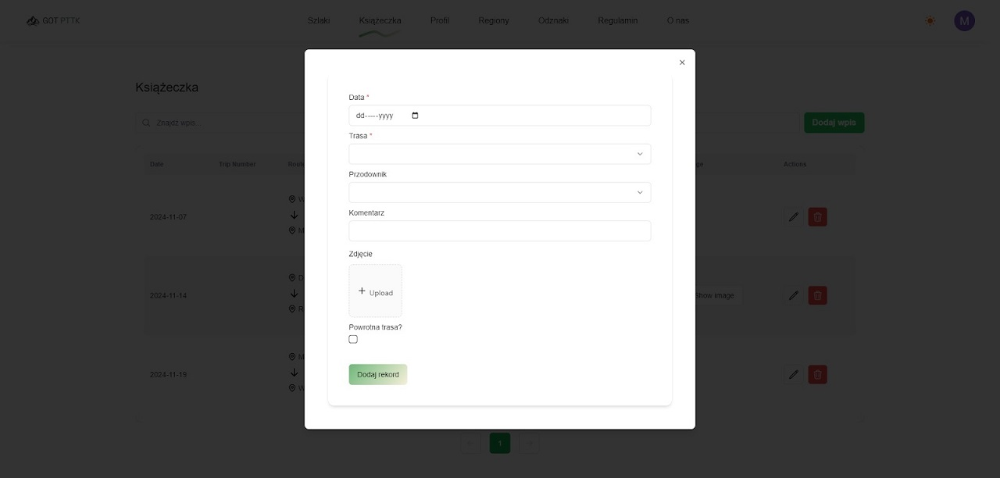
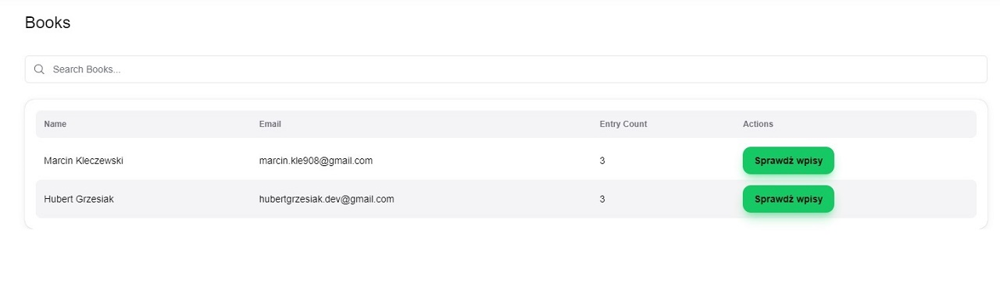
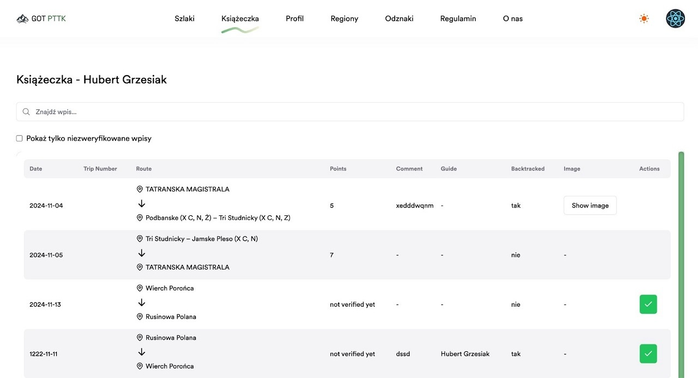
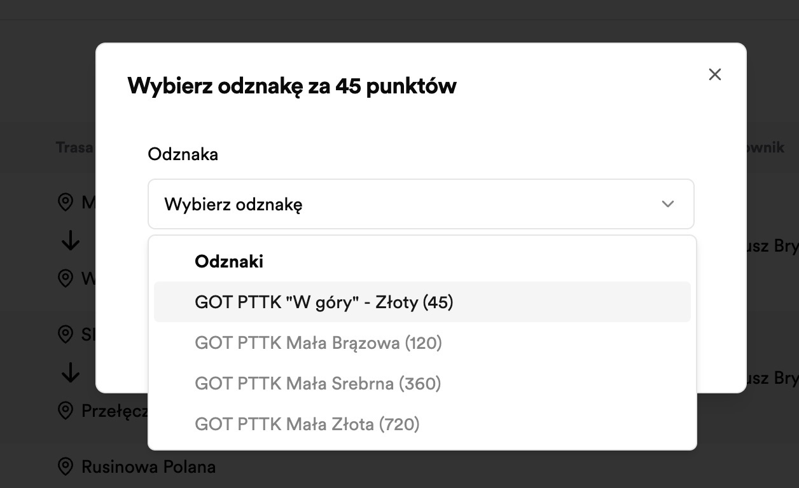
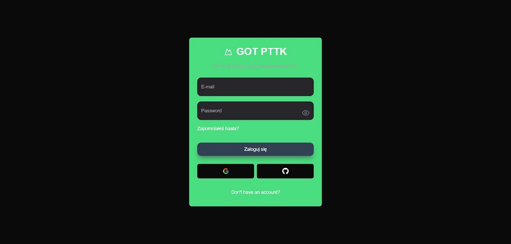
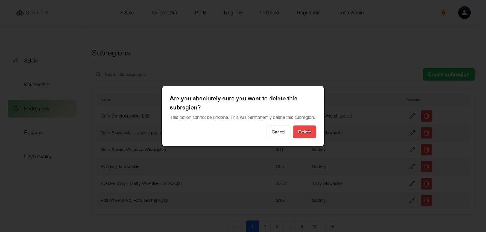
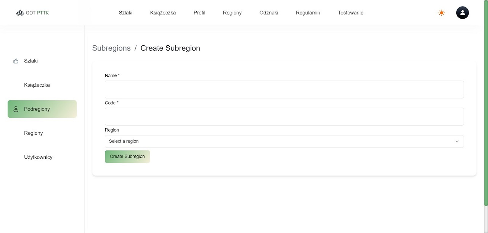
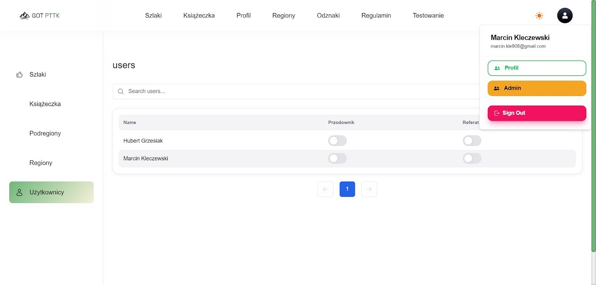
